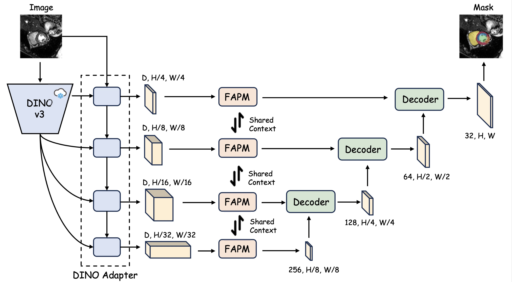

# Dino U-Net

[中文文档](./README-zh.md)

This is the official repository for Dino U-Net: Exploiting High-Fidelity Dense Features from Foundation Models for Medical Image Segmentation.


> **[Dino U-Net: Exploiting High-Fidelity Dense Features from Foundation Models for Medical Image Segmentation.](https://arxiv.org/pdf/2508.20909)**
> <br>Yifan Gao, Haoyue Li, Feng Yuan, Xiaosong Wang*, and Xin Gao*<br>
> 1 University of Science and Technology of China<br> 2 Shanghai Innovation Institute<br> 3 Shanghai Artificial Intelligence Laboratory<br>

This repository contains the official implementation of **Dino U-Net**, a novel architecture for medical image segmentation that integrates a pre-trained DINOv3 foundation model within U-Net architecture. By leveraging the high-fidelity dense features from DINOv3, Dino U-Net achieves state-of-the-art performance on various medical image segmentation tasks.

## Features

- **Foundation Model**: Utilizes the powerful DINOv3 as the high-fidelity feature extractor.
- **Multiple Model Sizes**: Supports various DINOv3 model sizes, from ViT-S (~22M params) to ViT-7B (~7B params), allowing flexibility between performance and computational cost.
- **nnU-Net Integration**: Built upon the robust and widely-used nnU-Net framework for data preprocessing, training, and evaluation.
- **High Performance**: Achieves excellent results by transferring knowledge from natural images to medical segmentation tasks.

## Supported Models

Dino U-Net supports several DINOv3 model variants, each with different parameter counts and computational requirements:

| Model Name      | DINOv3 Backbone | Act. Params | Pre-trained Checkpoint                                        |
|-----------------|-----------------|------------|---------------------------------------------------------------|
| `dinounet_s`    | ViT-S/16        | ~5M       | `dinov3_vits16_pretrain_lvd1689m-08c60483.pth` |
| `dinounet_b`    | ViT-B/16        | ~11M       | `dinov3_vitb16_pretrain_lvd1689m-73cec8be.pth` |
| `dinounet_l`    | ViT-L/16        | ~18M      | `dinov3_vitl16_pretrain_lvd1689m-8aa4cbdd.pth` |
| `dinounet_7b`   | ViT-7B/16       | ~220M        | `dinov3_vit7b16_pretrain_lvd1689m-a955f4ea.pth` |

## Prerequisites

- Python 3.8+
- PyTorch 1.10+
- CUDA-enabled GPU

## Installation

1.  **Clone the repository:**
    ```bash
    git clone https://github.com/yifangao112/DinoUNet.git
    cd dino-unet
    ```

2. Create a virtual environment `conda create -n dinounet python=3.10 -y` and activate it `conda activate dinounet`

3. Install Pytorch

4.  **Install the required packages:**
    It is recommended to create a virtual environment first.
    ```bash
    pip install -r requirements.txt
    ```

5.  **Install the MultiScaleDeformableAttention module:**
    ```bash
    cd dinounet/dinov3/eval/segmentation/models/utils/ops
    pip install .
    ```

6.  **Download the pre-trained DINOv3 checkpoints:**
    Download the desired DINOv3 checkpoints from the official repository or another source and place them in the `dinounet/checkpoints/` directory.

## Dataset Preparation

This project uses the **modified nnU-Net** framework for data handling. Please format your dataset according to the [nnU-Net guidelines](https://github.com/MIC-DKFZ/nnUNet/blob/master/documentation/dataset_format.md).

1.  **Structure your dataset** as follows:
    ```
    /path/to/dataset/
    ├── imagesTr/
    │   ├── case001_0000.nii.gz
    │   └── ...
    ├── labelsTr/
    │   ├── case001.nii.gz
    │   └── ...
    └── dataset.json
    ```

2.  **Set up nnU-Net Environment Variables:**
    nnU-Net uses three environment variables to manage paths for raw data, preprocessed data, and model results. 

    -   `nnUNet_raw`: Directory for storing raw datasets.
    -   `nnUNet_preprocessed`: Directory for storing preprocessed data.
    -   `nnUNet_results`: Directory for saving model weights and outputs.

    You need to set these variables in your environment. For Linux/macOS, you can add the following lines to your `.bashrc` or `.zshrc` file:

    ```bash
    export nnUNet_raw="/path/to/your/raw_data"
    export nnUNet_preprocessed="/path/to/your/preprocessed_data"
    export nnUNet_results="/path/to/your/model_results"
    ```

    For more detailed instructions, including for Windows, please see the [official nnU-Net documentation](https://github.com/MIC-DKFZ/nnUNet/blob/master/documentation/set_environment_variables.md).

## Training

You can train a Dino U-Net model using the `dinounet_training.py` script. The script handles data preprocessing, model building, and training.

**Usage:**

```bash
python dinounet_training.py --gpuid <GPU_ID> --model <MODEL_NAME> --datasetid <DATASET_ID> --epoch <NUM_EPOCHS>
```

**Arguments:**

- `--gpuid`: The ID of the GPU to use for training (e.g., `0`).
- `--model`: The name of the model to train. Choose from `dinounet_s`, `dinounet_b`, `dinounet_l`, `dinounet_7b`.
- `--datasetid`: The integer ID of your dataset, as registered with nnU-Net.
- `--epoch`: The number of epochs to train for.

**Example:**

To train the `dinounet_s` model on dataset ID `9` for 200 epochs on GPU `2`:

```bash
python dinounet_training.py --gpuid 2 --model dinounet_s --datasetid 9 --epoch 200
```

The script will automatically:
1.  Preprocess the dataset.
2.  Configure the network architecture.
3.  Train the model.
4.  Save the results and logs to the directory specified by `nnUNet_results`.

Note:
- If you have previously generated nnU-Net plans, please set `force_rerun=true` for preprocessing to rebuild the plans and avoid using stale caches.

## Evaluation

After training, the script automatically proceeds to the evaluation phase. It will compute metrics such as Dice score and Hausdorff Distance on the validation set. The results will be printed to the console and saved in the results folder.

## Extending Dino U-Net

See the full extension guide here: [extending-dinounet](./assets/extending.md) · [中文扩展指南](./assets/extending_zh.md)

## Acknowledgements

We gratefully acknowledge the following open-source projects that our work builds upon:
- nnU-Net ([docs](https://github.com/MIC-DKFZ/nnUNet), [dataset format](https://github.com/MIC-DKFZ/nnUNet/blob/master/documentation/dataset_format.md)).
- DINOv3 ([repo](https://github.com/facebookresearch/dinov3)).
